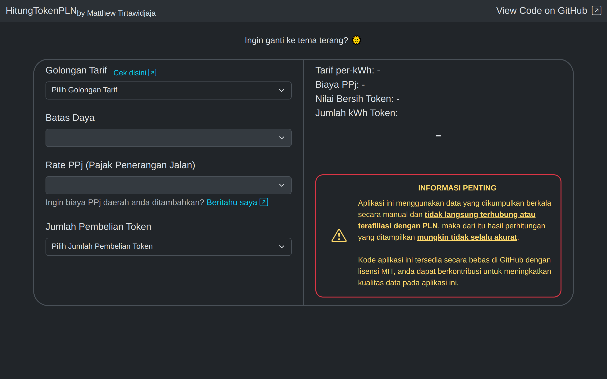

# HitungTokenPLN


Aplikasi kalkulator penghitung jumlah kWh atau nilai token dari pembelian listrik PLN berbasis aplikasi web statik.

Data tarif yang digunakan oleh aplikasi kalkulator berbasis web ini diambil dari web resmi PLN, sedangkan untuk data PPj (Pajak Penerangan Jalan) daerah diambil dari berbagai sumber seperti:
- Analisa persentase dari struk hasil pembelian PLN
- Dokumen penetapan PPj dari Website daerah
- Hasil terpercaya dari mesin penelusuran internet

<br>

Jika anda ingin memberikan saran atau ingin membantu kami menambahkan atau mengedit data aplikasi, silahkan [mengisi form ini](https://forms.gle/doaHdRWZHsz35Kwx7).

<br>

## Gambar aplikasi



<br>

## Disclaimer

Aplikasi ini menggunakan data yang dikumpulkan berkala secara manual dan tidak langsung terhubung atau terafiliasi dengan PLN, maka dari itu hasil perhitungan yang ditampilkan mungkin tidak selalu akurat.

<br>

## Data Format Documentation

Data tarif dan PPj disimpan pada file data.json pada folder utama proyek ini, yang akan diambil oleh browser user dikarenakan aplikasi berbasis web ini hanya berisi file statik.

Struktur JSON yang digunakan adalah:

```jsonc
{
	"tarif-listrik": {
		"... id golongan ..." : {
			"... batas daya beban ...": 1352.00 // rate dalam rupiah
		},
		"... id golongan ..." : 1699.53 // rate dalam rupiah, golongan tanpa batas daya beban
	},
	"tarif-ppj": {
		"... nama daerah ...": {
			"... id golongan ..." : {
				"... batas daya beban ...": 0.03, // PPj 3%
			},
			"... id golongan ..." : 0.03 // PPj 3%, untuk semua daya beban pada golongan ini
		},
		"... nama daerah ...": 0.03 // PPj 3%, untuk semua golongan dan daya beban pada daerah ini
	}
}
```

Dimana:
- ``...id golongan ...`` merupakan ID golongan yang didapatkan dari web resmi PLN (contoh: ``R-1/TR``)
- ``... batas daya beban ...`` merupakan rentang beban yang ada pada ID golongan tersebut (contoh: ``900 VA``)
- ``... nama daerah ...`` merupakan nama dari sebuah daerah yang memiliki data tarif PPj (contoh: ``Jawa Barat``)

<br>

## Kontributor

Seluruh kontributor selain saya dapat dilihat pada file [CONTRIBUTORS.md](CONTRIBUTORS.md).

Untuk mengetahui cara untuk berkontribusi pada proyek ini, silahkan baca [CONTRIBUTING.md](CONTRIBUTING.md).

Terima kasih kepada semua kontributor yang telah membantu proyek aplikasi ini 🎉

## Lisensi pada proyek ini

Copyright (c) 2024 Matthew Tirtawidjaja

Proyek ini (termasuk seluruh perangkat lunak dan asset gambar) dilisensikan menggunakan standar lisensi MIT.

Anda dapat menggunakan, menyalin, mengubah, mengabungkan, menerbitkan, mendistribusikan, mensublisensikan, dan/atau menjual salinan perangkat lunak pada proyek ini, selama:

Pemberitahuan hak cipta pemilik dan perizinan standar MIT seperti yang dapat dilihat pada file [LICENSE](LICENSE) harus disertakan dalam semua salinan atau bagian penting dari perangkat lunak proyek ini. 

\- Untuk informasi lebih lanjut, cek file [LICENSE](LICENSE).